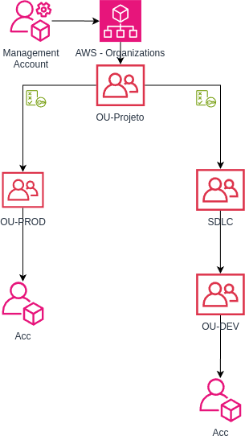
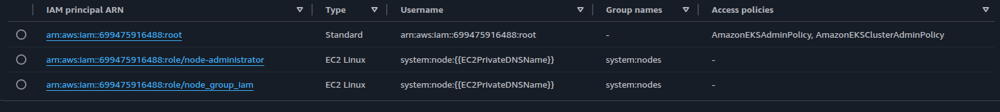

### Objetivos
- Prática de IAC com Terraform e Cloud AWS.
    - Terraform deve ser modular
- Deve prover RemoteState e StateLock.
- Usar pipeline para deployar infra.
- Prover um ambiente base para laboratórios kubernetes.
- O laboratório deve estar documentado e ser replicável
    - Dados sensíveis não devem estar no repositório, documentação deve apontar sua necessidade quando houver.


### Diagrama de Arquitetura dos Recursos AWS - Production


### Diagrama Organizations AWS


## Security Groups
- Egress full allow 0.0.0.0/0
### SG-0
- Ingress 80/443 full allow 0.0.0.0/0
### SG-01
- Ingress 22 MyIp 
- Ingress 5432 from SG-03
### SG-02
- Ingress 22 from SG-01
- Ingress 5432 from SG-03ws
- Ingress 80/443 from SG-0
### SG-03
- Ingress 5432 from SG-02
- Ingress 5432 from SG-01


### Documentação

- [Instâncias RDS ](https://aws.amazon.com/pt/rds/instance-types/)

### Links provider
- [VPC](https://registry.terraform.io/providers/hashicorp/aws/latest/docs/resources/vpc)
- [Subnet](https://registry.terraform.io/providers/hashicorp/aws/latest/docs/resources/subnet)
- [IGW](https://registry.terraform.io/providers/hashicorp/aws/latest/docs/resources/internet_gateway)
- [IGW - Attach](https://registry.terraform.io/providers/hashicorp/aws/latest/docs/resources/internet_gateway_attachment)
- [Nat Gateway](https://registry.terraform.io/providers/hashicorp/aws/latest/docs/resources/nat_gateway)

- [Route Table](https://registry.terraform.io/providers/hashicorp/aws/latest/docs/resources/route_table)
- [Security Group](https://registry.terraform.io/providers/hashicorp/aws/latest/docs/resources/security_group)


- [Roles IAM para EKS](https://docs.aws.amazon.com/eks/latest/userguide/cluster-iam-role.html)
- [EKS add-ons](https://docs.aws.amazon.com/eks/latest/userguide/workloads-add-ons-available-eks.html)

- [RDS](https://registry.terraform.io/providers/hashicorp/aws/latest/docs/resources/db_instance)


### Além das policys é necessário criar o acces entry


### Utils

- Adicionar cluster eks ao kubeconfig

```
aws eks update-kubeconfig --region us-east-1 --name eks-cluster --alias devopslabs
```

- Listar access policies
```
aws eks list-access-entries --cluster-name <NomeCluster>
```
- Listar access entrys 
```
aws eks list-access-entries --cluster-name <NomeCluster>
```
- Verificar o permissionamento de um principal
```
aws eks list-associated-access-policies --cluster-name <NomeCluster> --principal-arn <arnDoPrincipalRetornadoPeloComandoAnterior>
```
- Estrutura de diretórios
```bash
.
├── modules
│   ├── compute
│   │   ├── access-eks
│   │   ├── eks
│   │   └── vm
│   ├── data
│   │   └── rds
│   └── network
│       ├── igw
│       ├── nat-gateway
│       ├── route
│       ├── route_table
│       ├── rtb_association
│       ├── sg
│       ├── sg-rules
│       ├── subnet
│       └── vpc
├── environments/
│   ├── dev/
│   │   ├── variables.tf
│   │   └── terraform.tfvars
│   └── prod/
│       ├── variables.tf
│       └── terraform.tfvars
├── variables.tf
├── output.tf
└── main.tf
```
``` bash
terraform apply -var-file /environments/dev/terraform.tfvars
terraform apply -var-file /environments/prod/terraform.tfvars

terraform destroy -var-file /environments/dev/terraform.tfvars
terraform destroy -var-file /environments/prod/terraform.tfvars
```