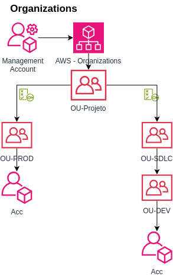
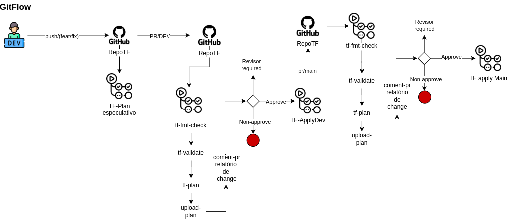

# Projeto: LAB de IAC (Terraform + AWS)

Este repositório contém um laboratório de Infraestrutura como Código (IaC) utilizando Terraform na AWS. O objetivo é criar um ambiente modularizado e automatizado, seguindo boas práticas como controle de versão, deploy multi-ambiente e pipelines de CI/CD.

###

## Objetivos
- **Praticar Infraestrutura como Código (IaC) utilizando Terraform na AWS.**
    - Terraform deve usar **modules**
    - Deve prover **RemoteState** e **StateLock**.
    - Git deve ser a **fonte de verdade**
    - Deve permitir deploy multi-ambiente
        - Ambiente dev o mais próximo possível de prod.
        - Dev: Dimensão menor de recursos, algumas features de resiliência e disponibilidade desabilitadas por billing 
            - exemplo: **Prod** RDS com DR multi-az **Dev** RDS apenas com backup.
- **Usar pipeline para deployar infra.**
    - **Github Actions**
    - **Usar gitflow**
- Prover um ambiente base para receber laboratórios de kubernetes.
- **O laboratório deve estar documentado.**
    - Dados sensíveis não devem estar no repositório.
- [Como rodar esse lab](./docs/replicar.md)

### Tecnologias usadas:

    


### Diagrama de Arquitetura dos Recursos AWS - Ambiente Production


### Diagrama Organizations AWS



### Diagrama do Gitflow



### GITFLOW usado:
- Main representando verdade do ambiente prod
    - implantação via pr da dev/hotfix com exigência de approve por revisor
    - Apenas no laborátorio foi permitido self-revision, em ambiente real quem submete não aprova.
- Dev representando a verdade do ambiente dev
    - Da dev sai as branchs de desenvolvimento.
    - Deploy na dev apartir de PR

### Justificativas da abordagem: 

<details closed>
<summary><strong>Github Actions</strong></summary>
<br>

- **Sequência Terraform**
    - Comando: terraform fmt -recursive -check
    - Comando: terraform validate
    - Comando: terraform plan
    - Comandos, buscam validar de forma automatizada o código terraform entregando um PR limpo para análise ao revisor. 
    - Se um dos comandos falharem, não há necessidade de avaliar o plan.
- **Uso de environment**
    - Facilita o gerenciamento e isolamento de ambientes
    - Permite o uso de váriaveis especificas para o ambiente, isso facilita o reaproveitamento de workflows que fazem a mesma coisa para ambientes diferentes.
    - Permite proteger as branchs, ou seja, **somente a branch que representa aquele ambiente implanta recursos**, além de regras mais refinadas.
    - Obrigar o codereview antes de um apply, desde approve simples, até refinados como codeOwner, impedir self-review, impedir admin-bypass.
- **Uso de workflow_call**
    - Permite reaproveitar um mesmo workflow em diversas lógicas, evitando repetição de código.
    - O Workflow de plan é usado via cal por outros workflows
- **Uso de actions script**
    - Faz um resumo do terraform plan e coloca como evidência no PR para facilitar o Review
    - Aponta no PR recursos que sofrerão alterações e dando enfase nos recursos sensíveis, exemplo banco de dados.
- **Uso de artifact**
    - Para armazenar o plano completo, caso precise de um review mais cuidadoso
- **Context**
    - Essa variável armazena um contexto: é PR : true or false
    - Se for PR o contexto para environment é a branch que recebe o PR
    - Se não for PR o contexto é o default.
- **Concurrency**
    - Evita que pipeline rodem juntas buscando o mesmo remotestate, embora a pipeline quebre por causa do state lock
    - O uso de concurrency permite o que a pipeline aguarde liberação do state além de uma proteção extra a apply simultâneo.

    
</details>

<details closed>
<summary><strong>AWS Security Groups</strong></summary>
<br>

- ❗ Importate: Toda a aplicação fica em subnete privada, sem tráfego de entrada
    - O tráfego de entrada do usuário apenas via ALB

- Pensado na idéia de reduzir superficie de ataque, onde cada SG aceita apenas o trafego necessário.
    - Exemplo: Banco de dados Postgres não precisa abrir portas 22, 3306, 443 etc..
        - Se abre a 5432 é apenas para o SG do recurso que vai consumir o banco.
- Usuário com ponto de entrada apenas pelo LoadBalancer.

| Security Group | Egress Rules               | Ingress Rules                                                                 |
|----------------|----------------------------|-------------------------------------------------------------------------------|
| **All SGs**    | Allow all (0.0.0.0/0)      | -                                                                             |
| **SG-0**       | -                          | Allow 80/443 from 0.0.0.0/0                                                   |
| **SG-01**      | -                          | Allow 22 from restricted-ip<br>Allow 5432 from SG-03                          |
| **SG-02**      | -                          | Allow 22 from SG-01<br>Allow 5432 from SG-03<br>Allow 80/443 from SG-0        |
| **SG-03**      | -                          | Allow 5432 from SG-02<br>Allow 5432 from SG-01                                |
    
</details>


<details closed>
<summary><strong>AWS Organizatios</strong></summary>
<br>

- Criar uma estrutura clara de separação/isolamento dos ambientes
- Podendo assim gerenciar atraves do AWS Organizations os aspectos desses ambientes
    - Permisionamento
    - Billing
    - Segurança
    - Dimensão

</details>


<details closed>
<summary><strong>Utils: Comandos AWS-CLI, ferramentas, extras</strong></summary>
<br>

[LENS - GUI para gerenciar cluster kubernetes](https://k8slens.dev/)

- Adicionar cluster eks ao kubeconfig

```
aws eks update-kubeconfig --region us-east-1 --name <nomeCluster> --alias <ApelidoCluster>
```

- Listar access policies
```
aws eks list-access-entries --cluster-name <NomeCluster>
```
- Listar access entrys 
```
aws eks list-access-entries --cluster-name <NomeCluster>
```
- Verificar o permissionamento de um principal
```
aws eks list-associated-access-policies --cluster-name <NomeCluster> --principal-arn <arnDoPrincipalRetornadoPeloComandoAnterior>
```

</details>

### Documentação de referência

- [Github Actions ](https://docs.github.com/en/actions)
- [Terraform](https://developer.hashicorp.com/terraform/language)
- [Terraform Provider](https://registry.terraform.io/providers/hashicorp/aws/latest)
- [AWS - EKS](https://docs.aws.amazon.com/eks/latest/best-practices/introduction.html)
- [Instâncias RDS ](https://aws.amazon.com/pt/rds/instance-types/)


### Estrutura de diretórios Terraform
```bash
.
├── modules
│   ├── compute
│   │   ├── access-eks
│   │   ├── eks
│   │   └── vm
│   ├── data
│   │   └── rds
│   └── network
│       ├── igw
│       ├── nat-gateway
│       ├── route
│       ├── route_table
│       ├── rtb_association
│       ├── sg
│       ├── sg-rules
│       ├── subnet
│       └── vpc
├── environments/
│   ├── dev/
│   │   ├── variables.tf
│   │   └── terraform.tfvars
│   └── prod/
│       ├── variables.tf
│       └── terraform.tfvars
├── variables.tf
├── output.tf
└── main.tf
```
